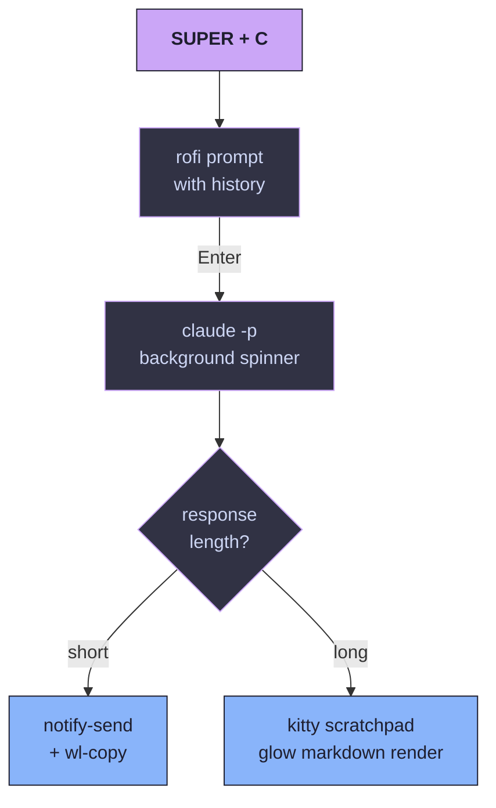
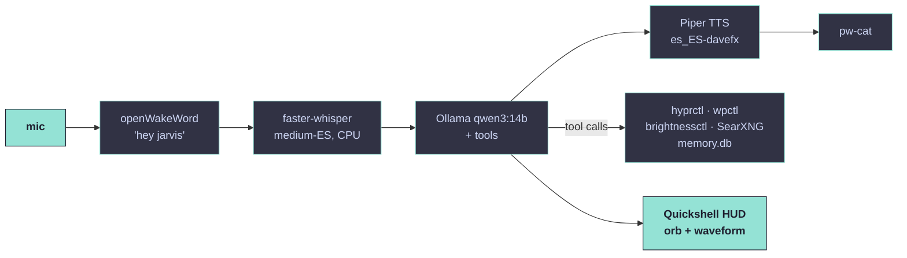

<div align="center">

<a href="https://github.com/haritzloza/nebula">
  
</a>

### Personal Hyprland dotfiles for **CachyOS** — gaming, development, and an embedded **Claude AI** widget

<br />

[](https://github.com/haritzloza/nebula/actions/workflows/ci.yml)
[](LICENSE)
[](https://cachyos.org)
[](https://hyprland.org)
[](https://www.zsh.org)
[](https://github.com/catppuccin/catppuccin)
[](https://claude.com/claude-code)

<br />

<p>
  <i>An opinionated, Stow-managed dotfiles setup with an interactive TUI installer,<br />
  dynamic Material You theming from your wallpaper, a Claude AI widget in the bar,<br />
  and a Pokémon greeting in every new terminal.</i>
</p>

<a href="#installation"></a>
&nbsp;
<a href="#preview"></a>
&nbsp;
<a href="#keybindings"></a>

</div>

---

## Table of Contents

- [Highlights](#highlights)
- [Preview](#preview)
- [Requirements](#requirements)
- [Installation](#installation)
- [Profiles](#profiles)
- [Keybindings](#keybindings)
- [The Claude widget](#the-claude-widget)
- [Jarvis — local voice assistant](#jarvis--local-voice-assistant)
- [Dynamic theming](#dynamic-theming)
- [Project structure](#project-structure)
- [Customization](#customization)
- [Uninstall / rollback](#uninstall--rollback)
- [Credits](#credits)
- [License](#license)

---

## Highlights

|  | Feature | Notes |
|---|---|---|
| **TUI installer** | Interactive `whiptail` menu | Pick a profile (`minimal` / `full`) or check components one by one in `custom` mode |
| **Claude AI widget** | Embedded in Waybar | Quick popup (`SUPER+C`) or full scratchpad (`SUPER+SHIFT+C`) — runs the official `claude` CLI |
| **Keybind cheatsheet** | Searchable Rofi popup | `SUPER+SHIFT+K` — auto-parsed from your `keybinds.conf` and executable inline |
| **Material You theming** | `matugen` + `swww` | Each wallpaper change regenerates the palette for Waybar, Rofi, Kitty, Hyprland and SwayNC |
| **Aesthetic wallpapers** | Curated MIT pack | `D3Ext/aesthetic-wallpapers` as a submodule (anime / ultrawide / lofi) |
| **Pokémon greeting** | `pokemon-colorscripts` + `fastfetch` | A random Pokémon next to system info on every new terminal |
| **System monitors** | `systemd --user` timers | Battery, CPU/GPU temperature and disk fill alerts with throttled notifications |
| **Modern lock & logout** | `hyprlock` + `wlogout` | Glass blur lock screen with battery readout, six-action exit menu |
| **Eye-care shaders** | `hyprshade` schedule | Auto blue-light filter 19:00-06:00; cycle shaders manually with `SUPER+SHIFT+S` |
| **Gaming-ready** | Hyprland tear-free rules | `immediate`, `noanim`, `noblur` for `steam_app_*` and `gamescope` |
| **GTK + cursor** | Catppuccin Mocha (Mauve) + Bibata cursor | Consistent look for nautilus, blueman, pavucontrol and every GTK app |
| **`bat`, `git`, `delta`** | Versioned dotfiles | Catppuccin pager for `git diff`, sensible aliases, global gitignore |
| **Auto pacman cache cleanup** | `paccache.timer` enabled | Trims old package versions weekly to free disk |
| **CI on the repo** | GitHub Actions | `shellcheck` + JSON/TOML/JSONC validation + LF line ending enforcement on every push |
| **Optional layers** | Stow-managed extras | Gaming pack, AI editors (VSCode / Cursor / Zed / Claude Desktop), hardening (UFW / sshd) |

## Preview

> [!NOTE]
> Real screenshots will replace the placeholders below — see [`docs/screenshots/`](docs/screenshots/) for the expected filenames and capture commands.

<div align="center">

<table>
<tr>
<td align="center" width="33%">

<br /><b>Desktop</b><br />
<sub>Waybar · Hyprland · wallpaper</sub>
</td>
<td align="center" width="33%">

<br /><b>Claude popup</b><br />
<sub>SUPER + C</sub>
</td>
<td align="center" width="33%">

<br /><b>Cheatsheet</b><br />
<sub>SUPER + SHIFT + K</sub>
</td>
</tr>
<tr>
<td align="center" width="33%">

<br /><b>Lock screen</b><br />
<sub>hyprlock with blur</sub>
</td>
<td align="center" width="33%">

<br /><b>Material You</b><br />
<sub>matugen + swww</sub>
</td>
<td align="center" width="33%">

<br /><b>Terminal greeting</b><br />
<sub>fastfetch + pokemon-colorscripts</sub>
</td>
</tr>
</table>

</div>

## Requirements

- **CachyOS** (or any Arch-based distro with `pacman`)
- **Hyprland** ≥ 0.41
- **GNU Stow** ≥ 2.4 (installed by the bootstrap if missing)
- A Nerd Font (JetBrainsMono Nerd Font is pulled in automatically)
- An AUR helper — the installer drops in `paru` if neither `paru` nor `yay` is present
- ~2 GB of disk for the base profile, ~6 GB for the `full` profile

## Installation

```bash
git clone --recurse-submodules https://github.com/haritzloza/nebula ~/.dotfiles
cd ~/.dotfiles
chmod +x install.sh
./install.sh                  # opens the TUI menu
```

> [!NOTE]
> The installer is **idempotent**. Re-running it only applies what has changed — safe to use as an update mechanism after `git pull`.

### Non-interactive modes

```bash
./install.sh --minimal        # Hyprland + Waybar + Kitty + Claude widget only
./install.sh --auto           # full profile, no prompts
./install.sh --dry-run        # show what would change without applying anything
./install.sh --skip-pkgs      # only refresh symlinks, skip pacman/AUR
./install.sh --hardening      # also apply UFW + sshd + sudoers
```

If you cloned without submodules, fetch the wallpapers separately:

```bash
git submodule update --init --recursive
```

## Profiles

| Profile | What it installs |
|---|---|
| **`minimal`** | Hyprland, Waybar, Kitty, Rofi, SwayNC, zsh + Starship, Claude widget |
| **`full`** | Everything: gaming pack, AI editors, dev stack, sysadmin tools, hardening, dynamic theming, SDDM Astronaut, monitors |
| **`custom`** | Whiptail checklist — pick exactly which optional layers you want |

Optional layers (selectable in `custom` mode):

- `theme_dynamic` — Material You via `matugen` + animated wallpapers via `swww`
- `gaming` — Steam, Lutris, MangoHud, gamescope, Wine
- `editors_ai` — VSCode (bin), Cursor IDE, Zed, Claude Desktop
- `dev_extra` — Neovim (LazyVim), tmux + TPM, lazygit, gh, docker, nodejs, rust
- `sysadmin` — k9s, lazydocker, sshfs, nmap, tcpdump
- `hardening` — UFW rules, hardened sshd, sudoers timeout
- `wallpapers` — clone the MIT aesthetic pack as a git submodule
- `sddm` — install and configure the SDDM Astronaut theme
- `monitors` — battery / temp / disk timers as systemd-user services

## Keybindings

### Essentials

| Shortcut | Action |
|---|---|
| `SUPER + RETURN` | Launch terminal (kitty) |
| `SUPER + SPACE` | App launcher (rofi) |
| `SUPER + Q` | Close window |
| `SUPER + SHIFT + E` | Quit Hyprland |
| `SUPER + F` | Toggle fullscreen |
| `SUPER + SHIFT + F` | Toggle floating |
| `SUPER + 1..0` | Switch to workspace 1-10 |
| `SUPER + SHIFT + 1..0` | Move window to workspace |
| `SUPER + arrow keys` | Focus direction |
| `SUPER + SHIFT + arrows` | Move window |

### Power features

| Shortcut | Action |
|---|---|
| `SUPER + SHIFT + K` | **Searchable keybind cheatsheet** (run-from-list) |
| `SUPER + C` | **Claude quick popup** |
| `SUPER + SHIFT + C` | Claude interactive scratchpad |
| `SUPER + F1` | Toggle special workspace for Claude |
| Decir `Hey Jarvis` | **Asistente local por voz** (si `jarvis` flag) |
| `SUPER + ALT + J` | Mute / unmute Jarvis wake word |
| `SUPER + ALT + SHIFT + J` | Jarvis push-to-talk |
| `SUPER + W` | Next wallpaper (regenerates palette if matugen is on) |
| `SUPER + G` | Gamemode visual toggle (kills blur/anims for max FPS) |
| `SUPER + SHIFT + S` | Cycle screen shader (off → blue-light → vibrance → grayscale) |
| `SUPER + V` | Clipboard history (cliphist) |
| `SUPER + L` | Lock screen (hyprlock) |
| `SUPER + SHIFT + X` | Logout menu (wlogout) |
| `Print` / `SHIFT + Print` / `SUPER + Print` | Screenshot region / output / window |

Media keys (`XF86Audio*`, `XF86MonBrightness*`) work out of the box via `wpctl`, `playerctl` and `brightnessctl`.

## The Claude widget

The flagship feature. Runs the official `claude` CLI under the hood, gated to keep your shell free.



- History persists in `~/.local/state/claude-popup/`
- Concurrent invocations are locked
- Waybar shows an idle / working indicator (pulses while Claude thinks)
- Global Claude Code settings, MCP servers and `CLAUDE.md` are versioned under [`claude/`](claude/.claude/)

## Jarvis — local voice assistant

Opt-in feature (`jarvis` flag) that adds a 100% local voice assistant — wake word, STT, LLM with tool-calling, TTS and a Quickshell HUD overlay. Designed for AMD GPUs (tested with RX 9070 XT / RDNA4).



**Requirements** (beyond the base profile)
- Kernel ≥ 6.13 with `linux-firmware-amdgpu` for RDNA4 (CachyOS recent kernels include it).
- ~10 GB free disk for the main model + voice + Whisper weights.
- ~12 GB free VRAM during inference (Qwen3-14B Q5_K_M + Hyprland headroom).
- Pipewire (already in the base profile).

**First-time setup** (after `./install.sh` with `jarvis` flag ON)

```bash
# 1) Modelos LLM (descarga única, ~6.5 GB + 274 MB)
ollama pull qwen3:14b
ollama pull nomic-embed-text

# 2) Voz Piper (descarga única, ~60 MB)
jarvisctl fetch-voice

# 3) Genera secret de SearXNG (la búsqueda web)
sed -i "s/CAMBIAR_TRAS_INSTALL_jarvisctl_regen_searxng_key/$(openssl rand -hex 32)/" \
    ~/.config/jarvis/searxng/settings.yml

# 4) Arranca el daemon (no auto-enabled para evitar bug de CachyOS)
systemctl --user start jarvis.service
```

**Atajos**

| Combinación | Acción |
|---|---|
| Decir `Hey Jarvis` | Activa la escucha (wake word) |
| `SUPER + ALT + J` | Mute / unmute del wake word |
| `SUPER + ALT + SHIFT + J` | Push-to-talk (forzar una sesión) |

**Capacidades**

- Conversación general en castellano con memoria de la sesión.
- Memoria persistente entre reinicios (`memory_store` / `memory_recall`).
- Control del sistema: volumen, brillo, workspaces, fullscreen / floating, abrir apps (allowlist).
- Búsqueda web vía SearXNG local (Docker, levantado on-demand).

**Seguridad**

- Las herramientas pasan por allowlist y validación pydantic (no `shell=True`, sin paths arbitrarios).
- Cada tool-call se loguea a `~/.local/state/jarvis/audit.log`.
- El daemon corre como `systemd --user`, no como root.

**Diagnóstico**

```bash
jarvisctl status
jarvisctl tail-session   # logs del daemon
jarvisctl tail-audit     # logs de tool-calls
jarvisctl ask "prueba"   # bypass voz, útil headless
journalctl --user -u jarvis.service -f
```

**Rollback**

```bash
systemctl --user disable --now jarvis.service jarvis-searxng.service
cd ~/path/to/dotfiles && stow -D jarvis
sudo pacman -Rns ollama-rocm
paru -Rns quickshell-git python-openwakeword python-faster-whisper piper-tts-bin python-sqlite-vec
```

## Dynamic theming

When the `theme_dynamic` option is enabled:

1. `swww` replaces `hyprpaper` and gives you animated wallpaper transitions
2. `SUPER+W` runs `matugen` over the active wallpaper
3. Matugen rewrites `~/.config/{hypr,waybar,kitty,rofi,swaync}/colors.*`
4. Waybar reloads via `SIGUSR2`, SwayNC reloads CSS, Hyprland picks up `colors.conf`

Templates live in [`matugen/.config/matugen/templates/`](matugen/.config/matugen/templates/) — edit them to control which Material You roles get exported to each app.

The matugen output paths live **outside** the Stow-managed config files so the symlinks are never modified. Each app `@import`s or `source`s the generated file at runtime.

## Project structure

Every top-level directory is an independent **Stow package**.

```
dotfiles/
├── install.sh                 # interactive bootstrap (whiptail)
├── Makefile                   # make link / make unlink / make check
├── packages/
│   ├── pacman.txt             # base pacman packages
│   ├── aur.txt                # base AUR packages
│   ├── gaming.txt             # optional gaming layer
│   ├── extra/                 # dev / sysadmin / editors-ai / monitors / sddm
│   └── profiles/              # minimal.profile, full.profile
├── hypr/                      # Hyprland config + scripts (Claude, cheatsheet, wallpaper, gamemode)
├── waybar/                    # Waybar config + Claude module + CSS
├── rofi/                      # launcher / cheatsheet / claude-prompt themes
├── kitty/                     # terminal config
├── nvim/                      # LazyVim entrypoint + CodeCompanion plugin
├── tmux/                      # prefix C-a + TPM
├── zsh/                       # zinit + aliases + fastfetch greeting
├── starship/                  # 2-line prompt
├── matugen/                   # Material You templates
├── swaync/                    # notification center
├── hyprpaper/                 # static wallpaper fallback
├── wlogout/                   # logout menu + glass style
├── fastfetch/                 # terminal greeting config
├── systemd-user/              # battery/temp/disk timers + scripts
├── sddm/                      # Astronaut theme config
├── security/                  # UFW / sshd / sudoers
├── ssh/                       # ssh/config template
├── scripts/                   # wallhaven fetcher, etc.
├── wallpapers/                # aesthetic submodule (MIT)
├── claude/                    # ~/.claude/ settings, MCP, global CLAUDE.md
├── git/                       # .gitconfig with delta + aliases + global ignore
├── gtk/                       # GTK 2/3/4 settings.ini (Catppuccin + Bibata)
├── bat/                       # bat pager config (Catppuccin theme + syntax maps)
└── .github/workflows/         # CI (shellcheck + JSON/TOML validators + LF enforcement)
```

## Customization

### Add your own wallpapers

Drop images in `~/Pictures/wallpapers/` (folder or symlink). `SUPER+W` will pick them up and, when matugen is on, recolor the desktop from each one. Supported: `jpg`, `jpeg`, `png`, `webp`.

### Tweak the Claude widget

Edit [`hypr/.config/hypr/scripts/claude-popup.sh`](hypr/.config/hypr/scripts/claude-popup.sh):

- `SCRATCH_LIMIT` — chars above which the response opens in a scratchpad instead of a notification
- `MODEL` env var — pin a specific Claude model (default uses what's set in `~/.claude/settings.json`)
- `ROFI_THEME` — swap the popup theme

### Change the color theme

Without dynamic theming, edit [`waybar/.config/waybar/style.css`](waybar/.config/waybar/style.css) — the base palette is Catppuccin Mocha. With matugen on, every wallpaper drives its own palette automatically.

### Customize keybindings

Edit [`hypr/.config/hypr/conf/keybinds.conf`](hypr/.config/hypr/conf/keybinds.conf). The cheatsheet (`SUPER+SHIFT+K`) re-parses the file at runtime — no rebuild needed.

## Uninstall / rollback

Stow makes everything reversible:

```bash
# Remove a single package
stow -D -t ~ hypr

# Remove everything that was linked
make unlink
```

The hardening layer ships with backups: `/etc/ssh/sshd_config.bak.<timestamp>` is created before the file is replaced.

## Credits

This is not a fork — it's a clean implementation that borrows the ideas I liked most from these excellent projects. Go give them a star.

| Project | What I borrowed |
|---|---|
| [`mylinuxforwork/dotfiles` (ML4W)](https://github.com/mylinuxforwork/dotfiles) | Overall structure, modular Hyprland config layout, Catppuccin palette |
| [`JaKooLit/Arch-Hyprland`](https://github.com/JaKooLit/Arch-Hyprland) | Modular installer, the keybind cheatsheet idea, systemd-user monitors, SDDM Astronaut |
| [`HyDE-Project/HyDE`](https://github.com/HyDE-Project/HyDE) | Dynamic theming concept (implemented here with matugen instead of `wallbash`) |
| [`end-4/dots-hyprland`](https://github.com/end-4/dots-hyprland) | Inspiration for embedding an AI assistant in the desktop |
| [`prasanthrangan/hyprdots`](https://github.com/prasanthrangan/hyprdots) | Ancestral aesthetic for many of these dotfiles |
| [`catppuccin/catppuccin`](https://github.com/catppuccin/catppuccin) | The Mocha palette used everywhere |
| [`D3Ext/aesthetic-wallpapers`](https://github.com/D3Ext/aesthetic-wallpapers) | MIT wallpaper pack shipped as a submodule |

Special thanks to the Hyprland community and the maintainers of `claude-code`, `matugen`, `swww`, `hyprlock`, `hypridle` and `pokemon-colorscripts`.

## License

[MIT](LICENSE) — do what you want, attribution appreciated. Vendored projects (wallpapers submodule, third-party scripts) retain their original licenses.

## Star History

<a href="https://www.star-history.com/#haritzloza/nebula&Date">
  <picture>
    <source media="(prefers-color-scheme: dark)" srcset="https://api.star-history.com/svg?repos=haritzloza/nebula&type=Date&theme=dark" />
    <source media="(prefers-color-scheme: light)" srcset="https://api.star-history.com/svg?repos=haritzloza/nebula&type=Date" />
    
  </picture>
</a>

---

<div align="center">


<sub>Built for <a href="https://cachyos.org">CachyOS</a> by <a href="https://github.com/haritzloza">Haritz Lozano</a> · Made in Azpeitia, Basque Country</sub>

</div>
