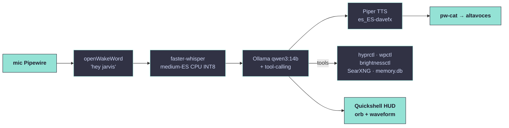

# Jarvis — guía de instalación y uso

Asistente conversacional **100% local** integrado en `nebula`. Sin API, sin tokens, sin nube. Diseñado y probado en **AMD RX 9070 XT** (RDNA4, gfx1201, 16 GB VRAM) sobre **CachyOS + Hyprland**, pero funciona en cualquier Arch reciente con una GPU compatible con ROCm o Vulkan.

> Si solo quieres el resumen del feature, mira la sección [Jarvis del README](../README.md#jarvis--local-voice-assistant). Este documento es la guía operativa.

---

## Índice

1. [Qué hace exactamente](#qué-hace-exactamente)
2. [Requisitos](#requisitos)
3. [Instalación paso a paso](#instalación-paso-a-paso)
4. [Validación fase por fase](#validación-fase-por-fase)
5. [Atajos y uso diario](#atajos-y-uso-diario)
6. [Configuración (`config.toml`)](#configuración-configtoml)
7. [Tools y permisos](#tools-y-permisos)
8. [Troubleshooting](#troubleshooting)
9. [Rollback / desinstalar](#rollback--desinstalar)
10. [FAQ](#faq)

---

## Qué hace exactamente



- **Wake word "Hey Jarvis"** siempre escuchando (CPU, ~5–10% de un core, ~50 MB RAM).
- **STT** en castellano con faster-whisper `medium` en CPU (latencia <1 s para frases cortas).
- **LLM con tool-calling**: Qwen3-14B Q5_K_M en Ollama (ROCm). 10 GB VRAM aprox.
- **TTS** Piper voz `es_ES-davefx-medium`, neutra-profesional, RTF ~0.05.
- **UI**: HUD overlay Quickshell (orb pulsante + waveform + transcripción) anclado abajo-centro, *pass-through* al input (no roba clicks). Indicador adicional en Waybar.
- **Memoria persistente** entre sesiones (SQLite + sqlite-vec + embeddings `nomic-embed-text`).
- **Búsqueda web** local-friendly vía SearXNG en Docker (levantado on-demand).

---

## Requisitos

### Hardware

| Componente | Mínimo | Recomendado |
|---|---|---|
| GPU | 8 GB VRAM (modelos 7B) | **≥ 12 GB VRAM** para Qwen3-14B Q5 (probado con RX 9070 XT 16 GB) |
| RAM | 16 GB | 32 GB |
| Disco | ~12 GB libres | 20 GB libres (modelos + voces + Whisper) |
| Micrófono | Cualquier USB/integrado | Headset con cancelación (evita acople con TTS) |

### Software

- **CachyOS** o Arch Linux reciente.
- **Kernel ≥ 6.13** con `linux-firmware-amdgpu` (para RDNA4). Los kernels `linux-cachyos` recientes ya lo incluyen.
- **ROCm 7.x** vía `ollama-rocm` (lo instala el `install.sh`).
- **Hyprland** + **Pipewire** (ya vienen en el perfil base de `nebula`).
- **Docker** para SearXNG (lo instala el flag jarvis si no lo tienes).

### Verificación previa

```bash
uname -r                          # → 6.13+
ls /lib/firmware/amdgpu/gc_*.bin  # → debe existir gc_12* (RDNA4)
pactl info | grep "Server Name"   # → debe decir PulseAudio (on PipeWire ...)
arecord -l                        # → tu micro debe aparecer
```

Si algo falla aquí, **arregla esto antes de instalar Jarvis**.

---

## Instalación paso a paso

### 1. Clona los dotfiles (si no los tienes ya)

```bash
git clone --recurse-submodules https://github.com/haritzloza/nebula ~/.dotfiles
cd ~/.dotfiles
```

### 2. Lanza el instalador con flag `jarvis`

Dos formas:

**A) Menú TUI (recomendado primera vez)**

```bash
./install.sh
```

En el menú elige `custom` → marca `jarvis` con espacio → Enter. Marca también lo que quieras (`hypr`, `waybar`, etc.).

**B) Flag directo si ya tienes el resto instalado**

Edita `packages/profiles/custom.profile` o simplemente activa el flag al vuelo:

```bash
./install.sh --profile=custom
```

El instalador:

1. Añade paquetes desde `packages/extra/jarvis.txt` (pacman): `ollama-rocm`, `python-sounddevice`, `python-numpy`, `python-httpx`, `python-pydantic`, `python-tomli`, `docker`, `docker-compose`, etc.
2. Añade paquetes desde `packages/extra/jarvis-aur.txt` (AUR): `quickshell-git`, `python-openwakeword`, `python-faster-whisper`, `piper-tts-bin`, `python-sqlite-vec`.
3. Monta el stow package `jarvis/` → `~/.config/jarvis/`, `~/.config/quickshell/jarvis/`, `~/.config/systemd/user/{ollama,jarvis,jarvis-searxng}.service`, `~/.local/bin/jarvisctl`.
4. Hace `chmod +x` a los scripts.

> [!WARNING]
> `quickshell-git` compila Qt6 desde fuentes. Puede tardar **~5–10 min** la primera vez. Es normal.

### 3. Permisos de Docker (una sola vez)

```bash
sudo systemctl enable --now docker
sudo usermod -aG docker "$USER"
newgrp docker
```

Cierra sesión y vuelve a entrar para que el grupo `docker` quede activo. SearXNG no arrancará sin esto.

### 4. Descarga los modelos LLM

```bash
systemctl --user start ollama.service
ollama pull qwen3:14b              # ~6.5 GB
ollama pull nomic-embed-text       # 274 MB (embeddings para memoria)
```

Comprueba que la GPU se está usando:

```bash
ollama run qwen3:14b "Hola"
# en otra terminal:
radeontop                          # GPU debería estar 70-100%
```

### 5. Descarga la voz Piper

```bash
jarvisctl fetch-voice
# Descarga es_ES-davefx-medium.onnx (+ .json) a ~/.local/share/piper/voices/
```

Prueba el TTS:

```bash
jarvisctl say "Hola, soy Jarvis. Pruebas, uno dos tres."
```

Debes oír la voz por los altavoces. Si no, ve a [Troubleshooting → No oigo el TTS](#no-oigo-el-tts).

### 6. Genera el secret de SearXNG

```bash
sed -i "s/CAMBIAR_TRAS_INSTALL_jarvisctl_regen_searxng_key/$(openssl rand -hex 32)/" \
    ~/.config/jarvis/searxng/settings.yml
```

> [!IMPORTANT]
> Sin este paso SearXNG **falla al arrancar**. El secret se genera localmente y no sale de tu máquina.

### 7. Arranca el daemon

```bash
systemctl --user start jarvis.service
systemctl --user status jarvis.service --no-pager
```

Deberías ver `Active: active (running)`. Si no, ve a [Troubleshooting → El daemon no arranca](#el-daemon-no-arranca).

### 8. Primer "Hey Jarvis"

Mira el HUD: Quickshell debería estar mostrando un orb cyan tenue abajo-centro. Di claramente:

> **"Hey Jarvis, ¿qué tal?"**

Si funciona:

- El orb pasa a verde (`listening`).
- Tras 1–2 s de silencio cambia a violeta (`thinking`).
- Cuando empieza a hablar, naranja (`speaking`) y oyes la respuesta.

🎉 Si has llegado aquí, está funcionando.

---

## Validación fase por fase

Si algo falla, los scripts `_dev_*.py` te permiten aislar el problema. Están en `~/.config/jarvis/tools/`:

```bash
cd ~/.config/jarvis/tools

# Wake word
python _dev_wake.py 0.5            # threshold 0.5; di "hey jarvis"
# → debe imprimir: [HH:MM:SS] hey_jarvis_v0.1=0.XX

# STT (graba 5 s y transcribe)
python _dev_stt.py
# → lo que dijiste, transcrito en castellano

# TTS
python _dev_tts.py "Esto es una prueba del sintetizador."
# → debes oírlo
```

Si los tres funcionan por separado pero juntos no, el problema está en el daemon o en sus permisos: revisa `journalctl --user -u jarvis.service -f`.

---

## Atajos y uso diario

| Combinación | Acción |
|---|---|
| Decir `Hey Jarvis` | Activa la escucha (wake word) |
| `SUPER + ALT + J` | Mute / unmute del wake word (útil en reuniones) |
| `SUPER + ALT + SHIFT + J` | Push-to-talk one-shot (forzar sesión sin wake word) |
| Click izquierdo en el módulo Waybar | Toggle mute |
| Click derecho en el módulo Waybar | Push-to-talk |

### Frases de ejemplo

| Categoría | Frase | Tool que dispara |
|---|---|---|
| Volumen | "Sube el volumen al 60" | `set_volume` |
| Volumen | "Baja 20 puntos" | `change_volume` |
| Brillo | "Pon el brillo al 80" | `set_brightness` |
| Workspace | "Cambia al workspace 3" | `hyprland_workspace` |
| Ventana | "Pon esta ventana en pantalla completa" | `hyprland_toggle` |
| App | "Abre Firefox" | `launch_app` |
| Memoria | "Recuerda que mi cumpleaños es el 14 de marzo" | `memory_store` |
| Memoria | "¿Qué guardé sobre mi cumpleaños?" | `memory_recall` |
| Web | "Busca qué es CachyOS" | `web_search` |
| Charla | "Cuéntame un chiste" | (sin tool, respuesta directa) |

### Modo headless (debug, sin voz)

```bash
jarvisctl ask "Resume la teoría de la relatividad en una frase"
jarvisctl tail-session    # ver los logs en vivo
jarvisctl tail-audit      # ver tool-calls
```

### Autoarranque

Hyprland arranca el daemon vía `exec-once` en [autostart.conf](../hypr/.config/hypr/conf/autostart.conf) **solo si el servicio existe**. No necesitas hacer `systemctl enable` — eso evita el bug de boot de CachyOS [#637](https://github.com/CachyOS/linux-cachyos/issues/637).

---

## Configuración (`config.toml`)

Vive en `~/.config/jarvis/config.toml`. Tras editar, reinicia: `jarvisctl restart`.

Las secciones más útiles para tocar:

### `[llm]` — qué modelo usar

```toml
[llm]
model = "qwen3:14b"            # cualquier modelo de `ollama list`
temperature = 0.4              # 0.2 = más determinista, 0.8 = más creativo
keep_alive = "15m"             # cuánto mantiene el modelo en VRAM tras última query
```

### `[wake]` — sensibilidad del wake word

```toml
[wake]
threshold = 0.5                # ↑ si hay falsos positivos; ↓ si no te oye
mute_on_speak = true           # silenciar mic mientras Jarvis habla (anti-feedback)
```

### `[capture]` — VAD para cortar la frase

```toml
[capture]
silence_threshold = 0.015      # ↑ si entornos ruidosos cortan tarde
silence_duration_s = 1.2       # cuánto silencio antes de considerar que has terminado
max_utterance_s = 15.0         # techo de seguridad
```

### `[tts]` — voz y velocidad

```toml
[tts]
voice = "~/.local/share/piper/voices/es_ES-davefx-medium.onnx"
length_scale = 1.0             # <1 más rápido, >1 más lento
```

Otras voces ES disponibles (descárgalas a `~/.local/share/piper/voices/` desde [piper-voices en HuggingFace](https://huggingface.co/rhasspy/piper-voices/tree/main/es/es_ES)):

- `es_ES-sharvard-medium` (femenina, neutra)
- `es_ES-mls_9972-low` (muy ligera, calidad menor)

### `[tts.dsp]` — voz tipo doblaje (Pablo Sevilla / Eduardo Bosch)

El sintetizador Piper produce voz neutra masculina sin cuerpo. Para acercarla al timbre de doblaje español de Jarvis sin usar VRAM extra, hay una cadena `piper → sox → pw-cat` con pitch / EQ / compresor / reverb. Coste real: **~5–8% CPU adicional mientras habla, 0 GB VRAM, 0 GB disco**.

Valores por defecto (en `~/.config/jarvis/config.toml`):

```toml
[tts.dsp]
enabled = true
pitch_cents = -100             # 1 semitono más grave
tempo = 1.04                   # 4% más rápido (cadencia formal)
eq_low_hz = 200
eq_low_gain_db = 3.0           # cuerpo/pecho
eq_high_hz = 7500
eq_high_gain_db = -1.5         # quita brillo metálico de Piper
compand_attack_decay = "0.3,1"
compand_transfer = "6:-70,-60,-20"
compand_gain_db = -5
reverb_mix = 10                # estudio (0=seco, 100=catedral)
reverb_room_scale = 45
```

**Iterar sin reiniciar el daemon:**

```bash
# Edita ~/.config/jarvis/config.toml, guarda, y prueba al instante:
jarvisctl say "Buenos días, señor. Todos los sistemas operativos."

# Comparativa A/B contra Piper crudo:
jarvisctl say --raw "Buenos días, señor."        # voz neutra original
jarvisctl say        "Buenos días, señor."        # con DSP aplicado
```

`jarvisctl say` carga el `config.toml` cada vez, así que **no hace falta** reiniciar nada entre tweaks. Cuando estés contento con los valores, **sí** reinicia el daemon para que use los nuevos: `jarvisctl restart`.

**Cómo iterar los valores:**

| Problema percibido | Ajuste |
|---|---|
| Suena demasiado grave / "viejo" | `pitch_cents = -70` |
| No suena suficientemente adulto | `pitch_cents = -130` |
| Voz "metálica" o "robótica" | sube `eq_high_gain_db` (menos negativo, -1.0 o 0) |
| Falta cuerpo / suena delgado | `eq_low_gain_db = 4.0` |
| Eco a sala de iglesia | `reverb_mix = 5` |
| Demasiado seco / sin presencia | `reverb_mix = 15`, `reverb_room_scale = 60` |
| Habla demasiado rápido | `tempo = 1.0` |
| Falta el tono formal de narrador | `tempo = 1.06`, `pitch_cents = -90` |

**Volver a la voz Piper plana:**

```toml
[tts.dsp]
enabled = false
```

**Por qué esto no llega al 100% del doblaje:** el DSP modifica timbre y ambiente, pero la individualidad de la voz (acento, prosodia, pequeñas inflexiones de Pablo Sevilla o Eduardo Bosch) es propiedad del actor, no de los efectos. Para llegar al 90%+ harían falta voice cloning (Coqui XTTS-v2 con sample del actor), que consume ~3 GB VRAM y queda como futuro upgrade (ver [FAQ](#faq)).

---

## Tools y permisos

Toda llamada a una tool pasa por:

1. **Allowlist**: si el nombre no está en `REGISTRY` ([tools/__init__.py](../jarvis/.config/jarvis/tools/__init__.py)), se rechaza con `tool not allowed`.
2. **Validación pydantic**: argumentos validados contra el schema; tipos/rangos/literales chequeados.
3. **Ejecución sin shell**: `subprocess.run([...], shell=False)`. Nunca se interpreta una string.
4. **Audit log**: cada llamada queda en `~/.local/state/jarvis/audit.log` con timestamp, args y resultado.

### Apps permitidas para `launch_app`

Por defecto: `firefox kitty code obsidian spotify nautilus thunar yazi discord`.

Para añadir/quitar, edita la `Literal` en [tools/system.py](../jarvis/.config/jarvis/tools/system.py) y el `allowed_apps` en `config.toml`.

### Dispatchers de Hyprland permitidos

Solo `workspace`, `togglefloating`, `fullscreen`, `movetoworkspace`, `killactive`. **Jamás `exec` arbitrario**.

### Verificar el audit log

```bash
jarvisctl tail-audit
# 2026-05-13T18:42:01 set_volume args={"level":60} -> {"ok":true,"result":"Volumen al 60%"}
# 2026-05-13T18:42:34 launch_app args={"name":"firefox"} -> {"ok":true,"result":"Abriendo firefox"}
# 2026-05-13T18:43:12 rm_rf args={"path":"/"} -> {"error":"tool 'rm_rf' not allowed"}
```

---

## Troubleshooting

### El daemon no arranca

```bash
systemctl --user status jarvis.service --no-pager
journalctl --user -u jarvis.service -n 50 --no-pager
```

Causas comunes:

| Síntoma en logs | Causa | Solución |
|---|---|---|
| `ModuleNotFoundError: openwakeword` | AUR no instalado | `paru -S python-openwakeword` |
| `error: connection refused 11434` | Ollama no corre | `systemctl --user start ollama.service` |
| `failed to load model qwen3:14b` | No descargado | `ollama pull qwen3:14b` |
| `PortAudioError: Invalid device` | Pipewire no encuentra el mic | Reinicia `wireplumber`, comprueba `pavucontrol` |

### No oigo el TTS

```bash
# Test directo de pw-cat
echo "test" | piper --model ~/.local/share/piper/voices/es_ES-davefx-medium.onnx --output-raw \
    | pw-cat -p --format=s16 --rate=22050 --channels=1 -
```

Si no oyes nada:

- Comprueba el sink por defecto: `pactl get-default-sink` y prueba `pavucontrol`.
- Verifica que `pw-cat` esté en `PATH`: `which pw-cat` (viene con `pipewire`).
- Si usas auriculares Bluetooth: a veces tardan en aparecer; usa `pulseaudio` o cambia el sink.

### El wake word no me reconoce

```bash
python ~/.config/jarvis/tools/_dev_wake.py 0.3   # threshold más bajo
```

- Si con `0.3` sí te oye: baja `threshold` en `config.toml` a `0.4`.
- Si nunca te detecta: el micro probablemente no es el por defecto. Revisa con `pavucontrol` la pestaña "Entrada", y comprueba que el nivel se mueve al hablar.

### Falsos positivos del wake word

- Sube `threshold` a `0.6` o `0.7` en `config.toml`.
- O cambia a push-to-talk: `SUPER + ALT + J` (mute) y luego usa `SUPER + ALT + SHIFT + J` cuando quieras hablar.

### Acople TTS → mic (Jarvis se oye a sí mismo)

`mute_on_speak = true` (default) ya debería evitarlo. Si aún ocurre:

- Usa auriculares.
- Activa AEC de Pipewire: añade a `~/.config/pipewire/pipewire.conf.d/echo-cancel.conf`:
  ```
  context.modules = [
    { name = libpipewire-module-echo-cancel
      args = { source.props.node.description = "Echo Cancelled Source" } }
  ]
  ```
  y reinicia: `systemctl --user restart pipewire`.

### Ollama no usa la GPU

```bash
ollama run qwen3:14b "hola"
# En otra terminal:
radeontop                # GPU debería estar 70-100% durante la respuesta
```

Si va por CPU:

- Verifica `ollama-rocm` instalado: `pacman -Qi ollama-rocm`.
- ROCm detecta la GPU: `rocminfo | grep gfx`. Debería listar `gfx1201`.
- Si no la detecta, recompila Ollama desde fuente con `AMDGPU_TARGETS=gfx1201` (raro, solo en ROCm muy viejos).

### Plan B: Vulkan en vez de ROCm

Si ROCm da problemas, puedes usar `llama-server` con Vulkan:

```bash
sudo pacman -S llama.cpp-vulkan
llama-server -m ~/.cache/huggingface/qwen3-14b-q5_k_m.gguf -ngl 99 --host 127.0.0.1 --port 11434
```

Luego cambia en `config.toml`:

```toml
[llm]
endpoint = "http://127.0.0.1:11434"
# Sin cambios en model si llama-server emula la API /api/chat de Ollama
```

> [!NOTE]
> La compatibilidad de `llama-server` con el endpoint `tools` de Ollama no es 100%; puede que pierdas tool-calling en algunos modelos. Vulkan es solo plan B si ROCm se rompe tras un update.

### SearXNG no arranca

```bash
systemctl --user status jarvis-searxng.service
docker compose -f ~/.config/jarvis/searxng/docker-compose.yml logs
```

Causas comunes:

- **Secret no rotado**: tienes que ejecutar el `sed` del paso 6 de la instalación.
- **Puerto 8888 ocupado**: edita `docker-compose.yml` y cambia el puerto host (también en `config.toml`).
- **Usuario no en grupo `docker`**: `groups | grep docker` debe listarlo.

### El HUD Quickshell no aparece

```bash
qs -c jarvis    # arrancar a mano para ver errores
```

- Si dice `qs: command not found` → `paru -S quickshell-git`.
- Si dice errores QML → puede ser por una versión nueva de Quickshell que rompe la API; abre un issue.
- Si arranca pero no se ve nada: probablemente el daemon no está escribiendo al socket. `ls -la $XDG_RUNTIME_DIR/jarvis.sock` debería existir.

---

## Rollback / desinstalar

```bash
# 1) Para servicios
systemctl --user disable --now jarvis.service jarvis-searxng.service ollama.service

# 2) Desmonta el stow package (los symlinks desaparecen, los archivos siguen en el repo)
cd ~/.dotfiles && stow -D jarvis

# 3) Borra datos (memoria, logs, secrets) — opcional, pero recomendado si vas a reinstalar
rm -rf ~/.local/share/jarvis ~/.local/state/jarvis
rm -rf ~/.local/share/piper/voices/es_ES-davefx-medium.onnx*

# 4) Borra paquetes (opcional)
sudo pacman -Rns ollama-rocm
paru -Rns quickshell-git python-openwakeword python-faster-whisper piper-tts-bin python-sqlite-vec

# 5) Modelos descargados (~7 GB)
ollama rm qwen3:14b nomic-embed-text
```

El resto de los dotfiles sigue intacto.

---

## FAQ

### ¿Cuánta VRAM/RAM consume en idle?

- **Mientras escucha el wake word**: ~50 MB RAM, ~5-10% de un core CPU. VRAM = 0 (modelo descargado).
- **Tras la primera query**: ~10 GB VRAM con el modelo cargado, durante `keep_alive` (15 min default). Luego se libera solo.
- **Daemon Python**: ~150 MB RAM permanente.

### ¿Funciona offline?

Sí, todo excepto la búsqueda web (que necesita internet para alcanzar Google/Bing/etc. a través de SearXNG).

### ¿Puedo cambiar el modelo a uno más pequeño?

Sí. Edita `config.toml` → `[llm].model`. Opciones razonables:

- `qwen3:8b` — 5 GB VRAM, peor tool-calling pero más rápido.
- `hermes3:8b` — excelente tool-calling.
- `qwen2.5:14b` — alternativa a Qwen3.

Asegúrate de hacer `ollama pull <modelo>` antes.

### ¿Y otra voz? ¿O voz personalizada?

Tres niveles posibles, de menos a más fidelidad al doblaje real:

1. **Otra voz Piper neutra**: descarga `.onnx` + `.json` a `~/.local/share/piper/voices/` y cambia `[tts].voice`. ~50 MB extra, 0 VRAM.
2. **Piper + DSP estilo doblaje** (el que está activo por defecto): pitch / EQ / compresor / reverb con sox. Ver [`[tts.dsp]`](#ttsdsp--voz-tipo-doblaje-pablo-sevilla--eduardo-bosch). 0 VRAM, ~5-8% CPU extra.
3. **Voice cloning con Coqui XTTS-v2**: zero-shot cloning con un sample de 6-30 s. Llega al 85-90% de fidelidad a la voz fuente (sea Bettany original, Pablo Sevilla, o cualquier otro doblador). ~3 GB VRAM extra mientras habla y ~2 GB de disco. **No está implementado** porque rompe la promesa de "0 VRAM extra" del setup actual, pero es trivial añadirlo como `[tts.xtts]` opcional en el futuro.

### ¿Por qué no usa la GPU para Whisper?

Porque CTranslate2 (el backend de faster-whisper) no tiene soporte ROCm estable en gfx1201. `medium` en CPU INT8 es suficiente para frases cortas (<1 s). Si quieres GPU, usa `whisper.cpp` con Vulkan — está en la lista de mejoras futuras.

### ¿Se puede usar en otro idioma?

Sí, pero requiere cambios manuales:

1. Cambia `[stt].language` a `"en"` o el código ISO que sea.
2. Descarga otra voz Piper (en `~/.local/share/piper/voices/`) y ajusta `[tts].voice`.
3. El wake word `hey_jarvis` funciona razonablemente en cualquier idioma porque es entrenamiento fonético; si quieres uno custom, tienes que entrenar tu propio modelo con [microWakeWord](https://github.com/kahrendt/microWakeWord) o [openWakeWord training](https://github.com/dscripka/openWakeWord#training-new-models).
4. Adapta `prompts/system.md` al idioma.

### ¿Cómo añado una tool nueva?

Crea una función en `tools/`, registra con el decorador:

```python
from pydantic import BaseModel
from . import register, ToolError

class MyToolArgs(BaseModel):
    x: int

@register("my_tool", MyToolArgs, "Descripción para el modelo.")
async def my_tool(args: MyToolArgs) -> str:
    return f"got {args.x}"
```

Importa el módulo en [tools/__init__.py](../jarvis/.config/jarvis/tools/__init__.py) junto con `system`, `search`, `memory`. Reinicia el daemon.

### ¿Es realmente seguro el tool-calling?

Tan seguro como tu allowlist. El registry rechaza cualquier función no listada explícitamente, los argumentos pasan por pydantic (tipos cerrados + `Literal[...]`), y nada se ejecuta vía shell. Aun así:

- No añadas tools que ejecuten código arbitrario sin pensar dos veces.
- Revisa periódicamente el `audit.log`.
- Si abres acceso a `web_search`, asume que el modelo verá texto de terceros y podría ser víctima de inyección de prompts. Por eso `web_search` devuelve solo título/url/snippet, no scrapea cuerpos completos.

### ¿Y la privacidad?

- **Voz**: nunca sale de tu máquina (ni STT ni TTS).
- **LLM**: nunca sale (Ollama es local).
- **Memoria**: SQLite local en `~/.local/share/jarvis/memory.db`.
- **Búsqueda web**: SearXNG sí hace requests salientes a buscadores (Google, Bing, DDG, Brave, Wikipedia) **desde tu IP**. Si te molesta, comenta los engines que no quieras en `~/.config/jarvis/searxng/settings.yml`.

### ¿Cómo lo actualizo?

```bash
cd ~/.dotfiles
git pull
./install.sh --profile=custom --skip-pkgs   # re-stow sin tocar paquetes
ollama pull qwen3:14b                       # por si hay nueva versión del modelo
jarvisctl restart
```

Para actualizar paquetes:

```bash
./install.sh --profile=custom               # ejecuta pacman/AUR otra vez (idempotente)
```
